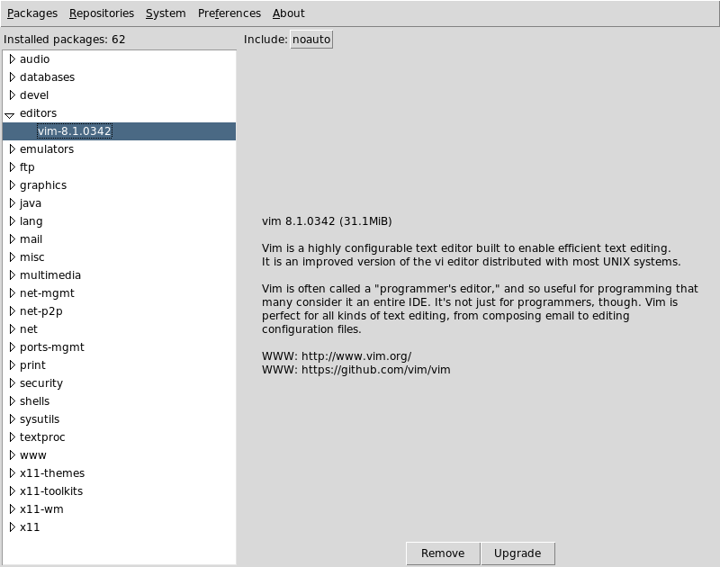
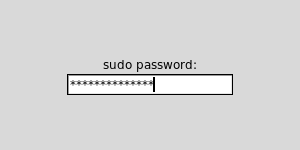

# pkgtk: FreeBSD package manager (pkgng) Tcl/Tk GUI.

## Install from source

    $ fetch -o pkgtk-master.tar.gz https://github.com/jrmsdev/pkgtk/archive/master.tar.gz
    $ tar -xzf pkgtk-master.tar.gz
    $ cd pkgtk-master
    $ make dist         # use dist to include building of translation files
    $ make build        # if you don't need translations
    $ sudo make install # by default on PREFIX=/usr/local

## Root privileges

When root privileges are needed `sudo(8)` is used. If your password is needed a pkgtk window will be opened asking for it.

Sudo is mainly used for `pkg(8)` actions or when writing repositoies configuration. Most of `pkg(8)` commands are run in *dry run* mode (-n) first under current user privileges, then, if the action is confirmed (-y), it runs again via `sudo(8)` for root privileges.

The same applies for `freebsd-update(8)`. But in that case most of its actions need root privileges.
