## pkg-clean
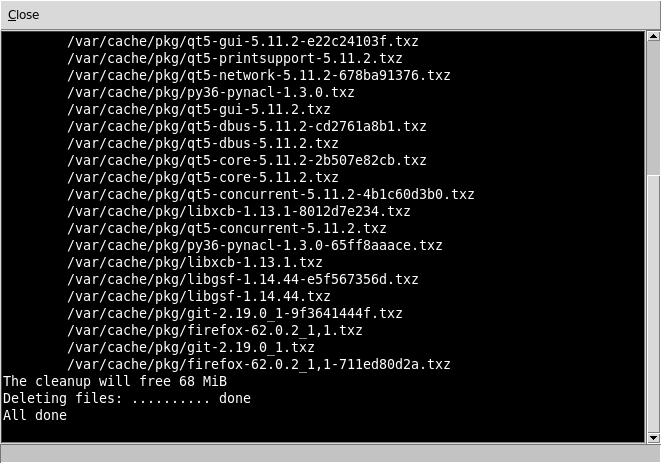

## pkg-install
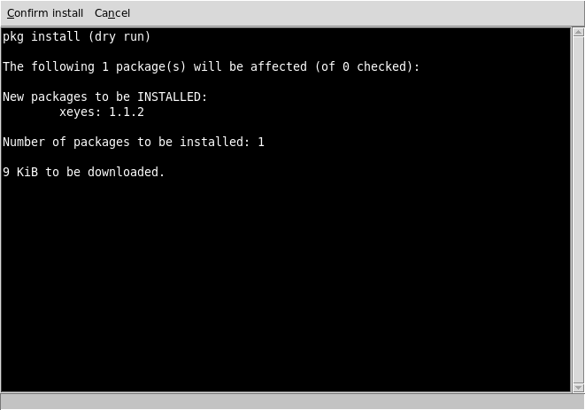

## pkg-install2
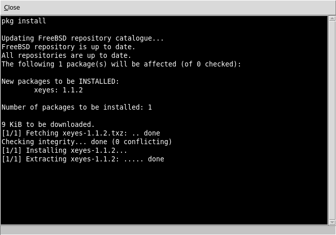

## pkg-remove
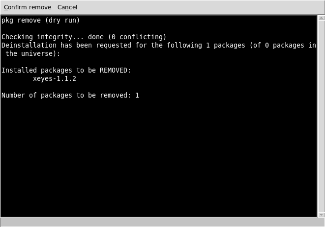

## pkg-remove2
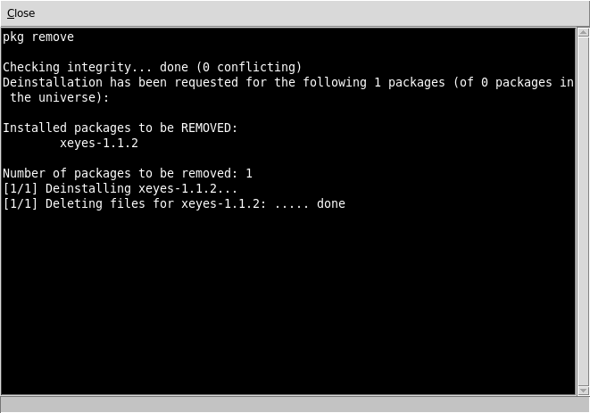

## pkg-search
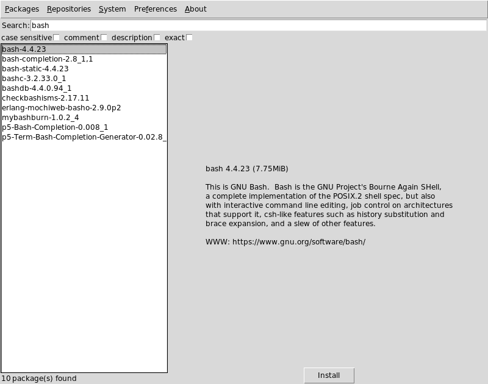

## pkg-upgrade
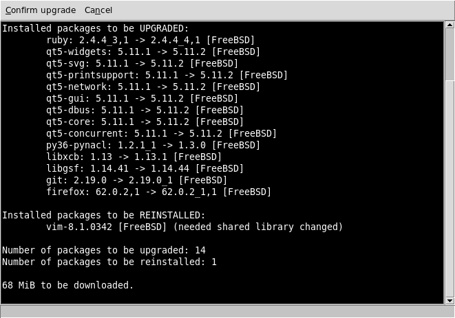

## pkg-upgrade2
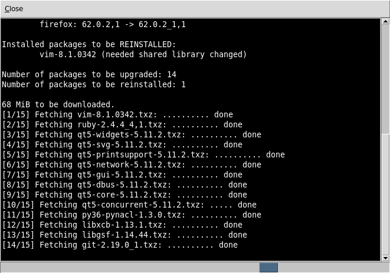

## repo-config
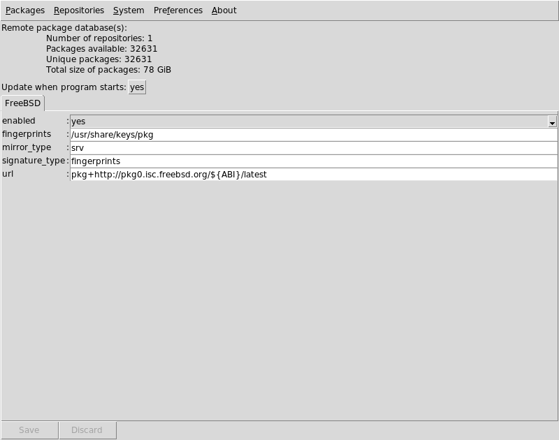

## repo-preferences
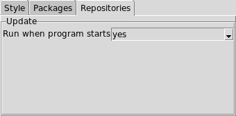

## repo-update
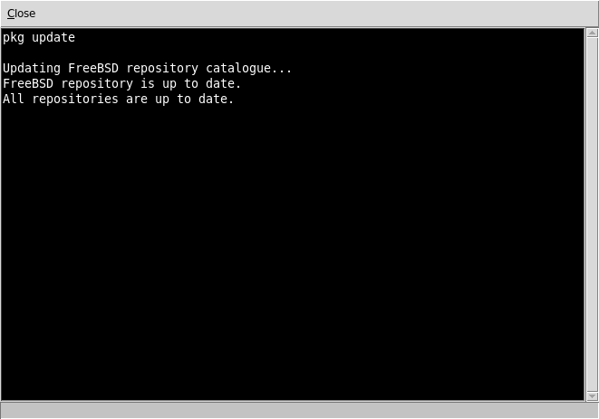

## sudo-askpass
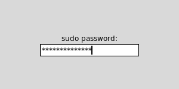

## system-fetch
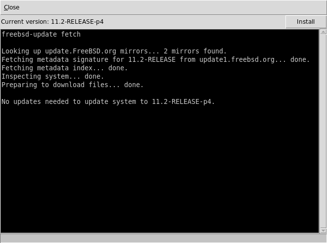

## view-available
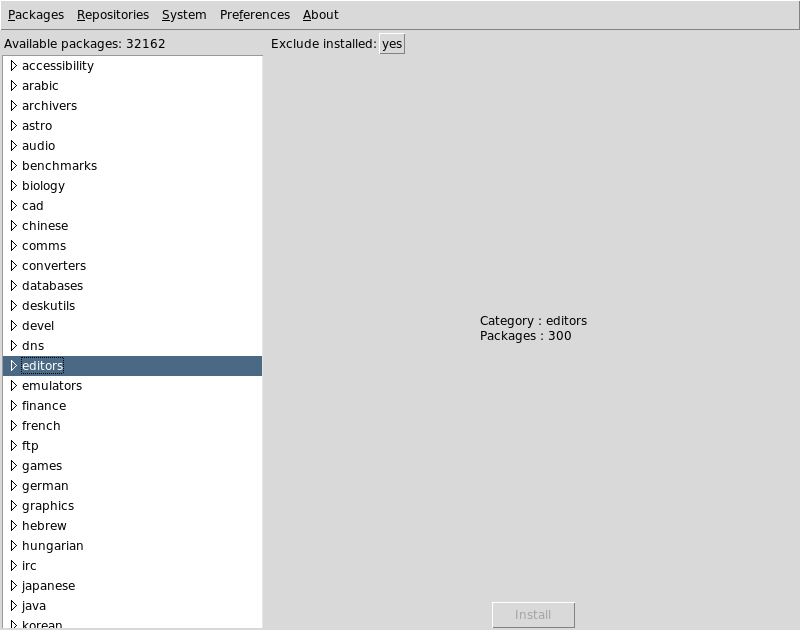

## view-installed
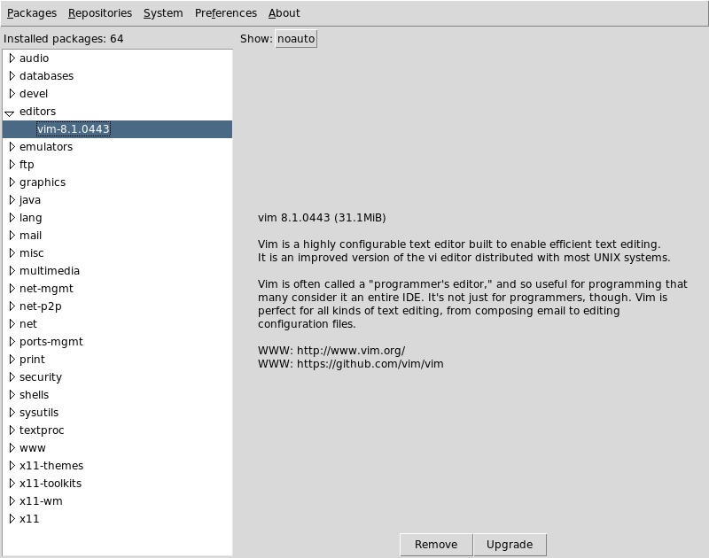

